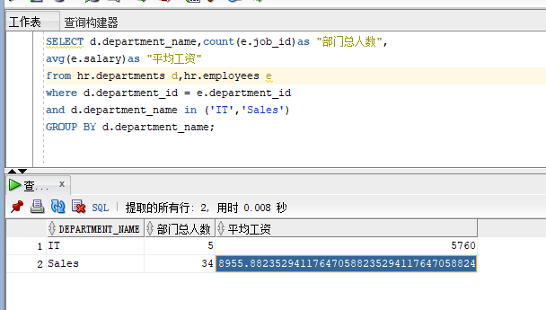
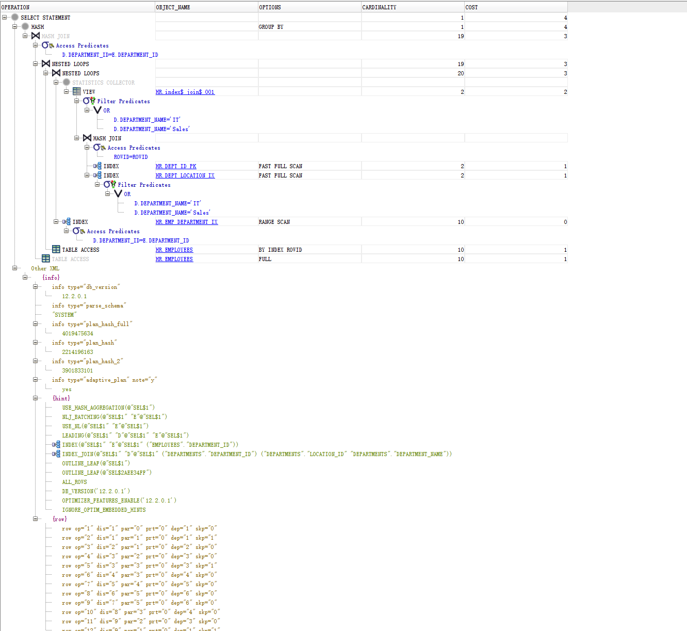
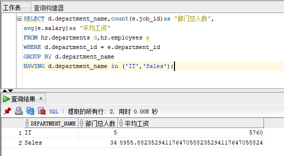
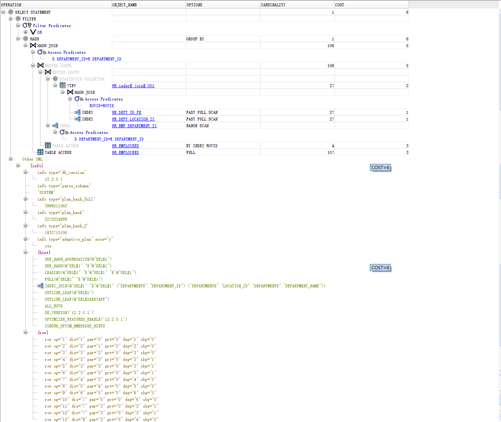
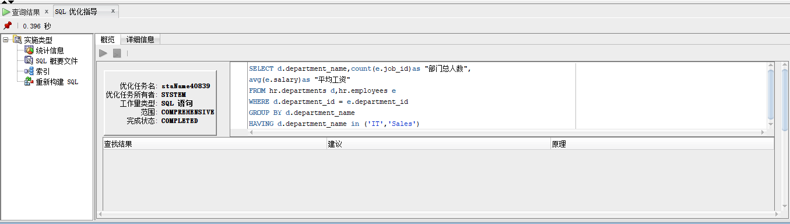
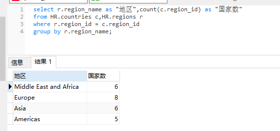

## 实验1：SQL语句的执行计划分析与优化指导
### 实验目的：
分析SQL执行计划，执行SQL语句的优化指导。理解分析SQL|语句的执行计划的重要作用。
### 实验内容：
1. 对Oracle12c中的HR人力资源管理系统中的表进行查询与分析。
2. 首先运行和分析教材中的样例：本训练任务目的是查询两个部门('IT'和'Sales')的部门总人数和平均工资，以下两个查询的结果是一样的。但效率不相同。
3. 设计自己的查询语句，并作相应的分析，查询语句不能太简单。

### 实验步骤：
1. 两种查询：
   1. 第一种

  ```sql
SELECT d.department_name,count(e.job_id)as "部门总人数",
avg(e.salary)as "平均工资"
from hr.departments d,hr.employees e
where d.department_id = e.department_id
and d.department_name in ('IT','Sales')
GROUP BY d.department_name;
  ```

查询结果：


第一中查询方法的执行计划：


 ```sql
SELECT d.department_name,count(e.job_id)as "部门总人数",
avg(e.salary)as "平均工资"
FROM hr.departments d,hr.employees 
WHERE d.department_id = e.department_id
GROUP BY d.department_name
HAVING d.department_name in ('IT','Sales');
 ```

查询结果：


第二种查询方法的执行计划:


**通过对上面两个查询语句的执行计划的分析，我觉得第一种查询语句更好一些。第二个语句的查询效果更好。查询更快。**
在Sql Develeper中执行优化指导：

Sql Develeper没有给出优化建议。
**自己的查询语句**

 ```sql
select r.region_name as "地区",count(c.region_id) as "国家数"
from HR.countries c,HR.regions r
where r.region_id = c.region_id 
group by r.region_name;
 ```

查询结果：



**通过region中的id和country中的regin_id来查询出每个地区所包含的国家有多少个。简单的查询语句，没有什么优化。**

