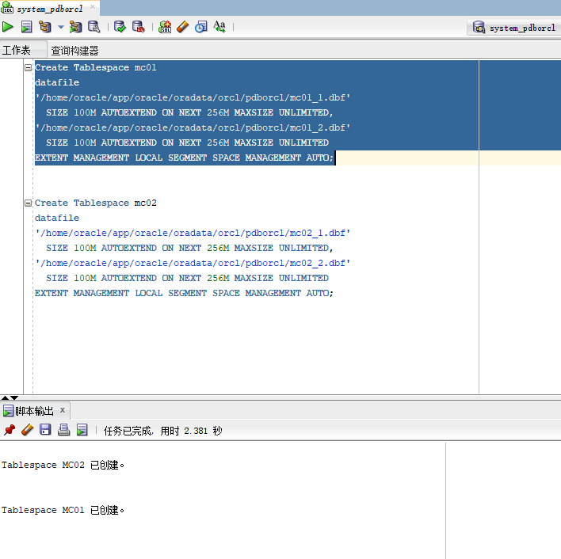
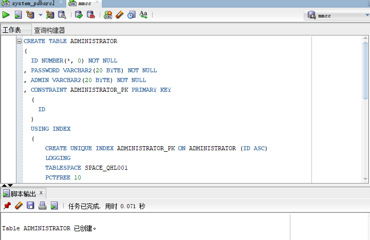
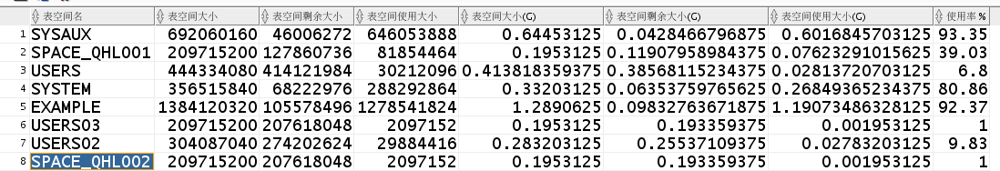

<!-- markdownlint-disable MD033-->
<!-- 禁止MD033类型的警告 https://www.npmjs.com/package/markdownlint -->

# 基于Oracle的图书销售系统的数据库分析与设计

### 成都大学信息科学与工程学院

|     学号     |     班级     | 姓名 |
| :----------: | :----------: | :--: |
| 201810414420 | 软件(本)18-4 | 马超 |

## 1. 概述
- 基于Oracle的书籍销售管理系统的实现。
- 管理员的功能主要有：一是添加书籍，二是查询书籍，三是修改书籍，以及对于用户的管理。
- 用户的功能是能够查找书籍，并且将书籍加入到购物车中，查询书籍的详细信息。
- 系统自动计算每个用户的购物车商品总金额。
## 2. 数据表设计

管理员表：

| 字段     | 类型    | 约束        | 默认值 | 说明     |
| -------- | ------- | ----------- | ------ | -------- |
| id       | int     | primary key |        | 管理员id |
| password | varchar | not null    |        | 密码     |
| admin    | varchar | not null    |        | 角色     |

​    员工表：
| 字段     | 类型    | 约束        | 默认值 | 说明   |
| -------- | ------- | ----------- | ------ | ------ |
| id       | int     | primary key |        | 员工id |
| password | varchar | not null    |        | 密码   |
| username | varchar | not null    |        | 用户名 |
| phone    | carchar | not null    |        | 电话   |
| address  | varcahr | not null    |        | 地址   |

商品表：

| 字段        | 类型    | 约束        | 默认值 | 说明   |
| ----------- | ------- | ----------- | ------ | ------ |
| id          | int     | primary key |        | 商品id |
| bookname    | varchar | not null    |        | 书名   |
| pricenumber | varchar | not null    |        | 价格   |
| describe    | varchar | not null    |        | 描述   |

购物车表：

| 字段        | 类型    | 约束        | 默认值 | 说明 |
| ----------- | ------- | ----------- | ------ | ---- |
| id          | int     | primary key |        | id   |
| amount      | varchar | not null    |        |      |
| pid         | varchar | not null    |        |      |
| bookuser_id |         | foreign key |        |      |

论坛表：

| 类型    | 约束        | 默认值 | 说明 |
| ------- | ----------- | ------ | ---- |
| int     | primary key |        | id   |
| content | not null    |        |      |


## 3. 创建表空间

创建两个表空间mc01和mc02

```sql
Create Tablespace mc01
datafile
'/home/oracle/app/oracle/oradata/orcl/pdborcl/mc01_1.dbf'
  SIZE 100M AUTOEXTEND ON NEXT 256M MAXSIZE UNLIMITED,
'/home/oracle/app/oracle/oradata/orcl/pdborcl/mc01_2.dbf'
  SIZE 100M AUTOEXTEND ON NEXT 256M MAXSIZE UNLIMITED
EXTENT MANAGEMENT LOCAL SEGMENT SPACE MANAGEMENT AUTO;


Create Tablespace mc02
datafile
'/home/oracle/app/oracle/oradata/orcl/pdborcl/mc02_1.dbf'
  SIZE 100M AUTOEXTEND ON NEXT 256M MAXSIZE UNLIMITED,
'/home/oracle/app/oracle/oradata/orcl/pdborcl/mc02_2.dbf'
  SIZE 100M AUTOEXTEND ON NEXT 256M MAXSIZE UNLIMITED
EXTENT MANAGEMENT LOCAL SEGMENT SPACE MANAGEMENT AUTO;
```



4. 创建角色和用户

**用户默认使用表空间mc01**
**创建第一个角色和用户**

- 创建角色mc将connect,resource,create view授权给mc
- 创建用户mmcc
- 分配90M空间给lh并将角色mc1授权给用户lh

```sql
CREATE ROLE mc;

GRANT connect,resource,CREATE VIEW TO mc;

CREATE USER mmcc IDENTIFIED BY 123 DEFAULT TABLESPACE mc01 TEMPORARY TABLESPACE temp;

ALTER USER mmcc QUOTA 60M ON mc01;

GRANT mc1 TO mmcc;

```

创建第二个角色和用户

创建角色mc2，将connect,resource权限给mc2
创建用户mmcc2
分配60M空间给mmcc2并将角色mc2授权给用户mmcc2

```sql
CREATE ROLE mc2;

GRANT connect,resource TO mc2;

CREATE USER mmcc2 IDENTIFIED BY 123 DEFAULT TABLESPACE mc01 TEMPORARY TABLESPACE temp;

ALTER USER mmcc2 QUOTA 60M ON mc01;

GRANT mc2 TO mmcc2;
```

## 4. 创建管理员表

```sql
CREATE TABLE ADMINISTRATOR 
(
  ID NUMBER(*, 0) NOT NULL 
, PASSWORD VARCHAR2(20 BYTE) NOT NULL 
, ADMIN VARCHAR2(20 BYTE) NOT NULL 
, CONSTRAINT ADMINISTRATOR_PK PRIMARY KEY 
  (
    ID 
  )
  USING INDEX 
  (
      CREATE UNIQUE INDEX ADMINISTRATOR_PK ON ADMINISTRATOR (ID ASC) 
      LOGGING 
      TABLESPACE mc01 
      PCTFREE 10 
      INITRANS 2 
      STORAGE 
      ( 
        BUFFER_POOL DEFAULT 
      ) 
      NOPARALLEL 
  )
  ENABLE 
) 
LOGGING 
TABLESPACE mc01 
PCTFREE 10 
INITRANS 1 
STORAGE 
( 
  BUFFER_POOL DEFAULT 
) 
NOCOMPRESS 
NO INMEMORY 
NOPARALLEL;
```



## 5. 创建用户表

```sql
CREATE TABLE BOOKUSER 
(
  ID NUMBER(*, 0) NOT NULL 
, PASSWORD VARCHAR2(20 BYTE) NOT NULL 
, USERNAME VARCHAR2(50 BYTE) NOT NULL 
, PHONE VARCHAR2(20 BYTE) NOT NULL 
, ADDRESS VARCHAR2(30 BYTE) NOT NULL 
, REGISTRATIONDATE DATE NOT NULL 
, CART_ID NUMBER(*, 0) NOT NULL 
, CONSTRAINT U_PK PRIMARY KEY 
  (
    ID 
  )
  USING INDEX 
  (
      CREATE UNIQUE INDEX U_PK ON BOOKUSER (ID ASC) 
      LOGGING 
      TABLESPACE mc01 
      PCTFREE 10 
      INITRANS 2 
      STORAGE 
      ( 
        BUFFER_POOL DEFAULT 
      ) 
      NOPARALLEL 
  )
  ENABLE 
) 
TABLESPACE mc01 
PCTFREE 10 
INITRANS 1 
STORAGE 
( 
  BUFFER_POOL DEFAULT 
) 
NOCOMPRESS 
NOPARALLEL 
PARTITION BY RANGE (REGISTRATIONDATE) 
SUBPARTITION BY RANGE (REGISTRATIONDATE) 
(
  PARTITION DATE2018 VALUES LESS THAN (TO_DATE(' 2018-12-31 00:00:00', 'SYYYY-MM-DD HH24:MI:SS', 'NLS_CALENDAR=GREGORIAN')) 
  TABLESPACE mc01 
  PCTFREE 10 
  INITRANS 1 
  STORAGE 
  ( 
    BUFFER_POOL DEFAULT 
  ) 
  NOCOMPRESS NO INMEMORY 
  (
    SUBPARTITION DATE2018_3 VALUES LESS THAN (TO_DATE(' 2018-03-31 00:00:00', 'SYYYY-MM-DD HH24:MI:SS', 'NLS_CALENDAR=GREGORIAN')) 
    NOCOMPRESS NO INMEMORY  
  , SUBPARTITION DATE2018_6 VALUES LESS THAN (TO_DATE(' 2018-06-30 00:00:00', 'SYYYY-MM-DD HH24:MI:SS', 'NLS_CALENDAR=GREGORIAN')) 
    NOCOMPRESS NO INMEMORY  
  , SUBPARTITION DATE2018_9 VALUES LESS THAN (TO_DATE(' 2018-09-30 00:00:00', 'SYYYY-MM-DD HH24:MI:SS', 'NLS_CALENDAR=GREGORIAN')) 
    NOCOMPRESS NO INMEMORY  
  , SUBPARTITION DATE2018_12 VALUES LESS THAN (TO_DATE(' 2018-12-31 00:00:00', 'SYYYY-MM-DD HH24:MI:SS', 'NLS_CALENDAR=GREGORIAN')) 
    NOCOMPRESS NO INMEMORY  
  )  
, PARTITION DATE2019 VALUES LESS THAN (TO_DATE(' 2019-12-31 00:00:00', 'SYYYY-MM-DD HH24:MI:SS', 'NLS_CALENDAR=GREGORIAN')) 
  TABLESPACE mc01 
  PCTFREE 10 
  INITRANS 1 
  STORAGE 
  ( 
    BUFFER_POOL DEFAULT 
  ) 
  NOCOMPRESS NO INMEMORY 
  (
    SUBPARTITION DATE2019_3 VALUES LESS THAN (TO_DATE(' 2019-03-31 00:00:00', 'SYYYY-MM-DD HH24:MI:SS', 'NLS_CALENDAR=GREGORIAN')) 
    NOCOMPRESS NO INMEMORY  
  , SUBPARTITION DATE2019_6 VALUES LESS THAN (TO_DATE(' 2019-06-30 00:00:00', 'SYYYY-MM-DD HH24:MI:SS', 'NLS_CALENDAR=GREGORIAN')) 
    NOCOMPRESS NO INMEMORY  
  , SUBPARTITION DATE2019_9 VALUES LESS THAN (TO_DATE(' 2019-09-30 00:00:00', 'SYYYY-MM-DD HH24:MI:SS', 'NLS_CALENDAR=GREGORIAN')) 
    NOCOMPRESS NO INMEMORY  
  , SUBPARTITION DATE2019_12 VALUES LESS THAN (TO_DATE(' 2019-12-31 00:00:00', 'SYYYY-MM-DD HH24:MI:SS', 'NLS_CALENDAR=GREGORIAN')) 
    NOCOMPRESS NO INMEMORY  
  )  
);

```

## 6. 创建商品表

```sql
CREATE TABLE COMMODITY 
(
  ID NUMBER(*, 0) NOT NULL 
, PID NUMBER(*, 0) NOT NULL 
, BOOKSNAME VARCHAR2(20 BYTE) NOT NULL 
, PRICE NUMBER NOT NULL 
, DESCRIBE VARCHAR2(50 BYTE) NOT NULL 
, NUM NUMBER(*, 0) NOT NULL 
, ADMIN_ID NUMBER(*, 0) NOT NULL 
, CONSTRAINT COMMODITY_PK PRIMARY KEY 
  (
    ID 
  )
  USING INDEX 
  (
      CREATE UNIQUE INDEX COMMODITY_PK ON COMMODITY (ID ASC) 
      LOGGING 
      TABLESPACE mc01 
      PCTFREE 10 
      INITRANS 2 
      STORAGE 
      ( 
        BUFFER_POOL DEFAULT 
      ) 
      NOPARALLEL 
  )
  ENABLE 
) 
LOGGING 
TABLESPACE mc01 
PCTFREE 10 
INITRANS 1 
STORAGE 
( 
  BUFFER_POOL DEFAULT 
) 
NOCOMPRESS 
NO INMEMORY 
NOPARALLEL;
```

## 7. 创建购物车表

- 用户表字段BOOKUSER_ID为购物车表的外键

- 购物车采用引用分区
```sql
CREATE TABLE CART 
(
  ID NUMBER(*, 0) NOT NULL 
, AMOUNT NUMBER(*, 0) NOT NULL 
, PID NUMBER(*, 0) NOT NULL 
, BOOKUSER_ID NUMBER(*, 0) NOT NULL 
, CONSTRAINT CART_PK PRIMARY KEY 
  (
    ID 
  )
  USING INDEX 
  (
      CREATE UNIQUE INDEX CART_PK ON CART (ID ASC) 
      LOGGING 
      TABLESPACE mc01 
      PCTFREE 10 
      INITRANS 2 
      STORAGE 
      ( 
        BUFFER_POOL DEFAULT 
      ) 
      NOPARALLEL 
  )
  ENABLE 
, CONSTRAINT CART_BOOKUSER FOREIGN KEY
  (
  BOOKUSER_ID 
  )
  REFERENCES BOOKUSER
  (
  CART_ID 
  )
  ENABLE 
) 
PCTFREE 10 
PCTUSED 40 
INITRANS 1 
STORAGE 
( 
  BUFFER_POOL DEFAULT 
) 
NOCOMPRESS 
NOPARALLEL 
PARTITION BY REFERENCE (CART_BOOKUSER) 
(
  PARTITION DATE2018_3 
  LOGGING 
  TABLESPACE mc01 
  PCTFREE 10 
  INITRANS 1 
  STORAGE 
  ( 
    BUFFER_POOL DEFAULT 
  ) 
  NOCOMPRESS NO INMEMORY  
, PARTITION DATE2018_6 
  LOGGING 
  TABLESPACE mc01 
  PCTFREE 10 
  INITRANS 1 
  STORAGE 
  ( 
    BUFFER_POOL DEFAULT 
  ) 
  NOCOMPRESS NO INMEMORY  
, PARTITION DATE2018_9 
  LOGGING 
  TABLESPACE mc01 
  PCTFREE 10 
  INITRANS 1 
  STORAGE 
  ( 
    BUFFER_POOL DEFAULT 
  ) 
  NOCOMPRESS NO INMEMORY  
, PARTITION DATE2018_12 
  LOGGING 
  TABLESPACE mc01 
  PCTFREE 10 
  INITRANS 1 
  STORAGE 
  ( 
    BUFFER_POOL DEFAULT 
  ) 
  NOCOMPRESS NO INMEMORY  
, PARTITION DATE2019_3 
  LOGGING 
  TABLESPACE mc01 
  PCTFREE 10 
  INITRANS 1 
  STORAGE 
  ( 
    BUFFER_POOL DEFAULT 
  ) 
  NOCOMPRESS NO INMEMORY  
, PARTITION DATE2019_6 
  LOGGING 
  TABLESPACE mc01 
  PCTFREE 10 
  INITRANS 1 
  STORAGE 
  ( 
    BUFFER_POOL DEFAULT 
  ) 
  NOCOMPRESS NO INMEMORY  
, PARTITION DATE2019_9 
  LOGGING 
  TABLESPACE mc01 
  PCTFREE 10 
  INITRANS 1 
  STORAGE 
  ( 
    BUFFER_POOL DEFAULT 
  ) 
  NOCOMPRESS NO INMEMORY  
, PARTITION DATE2019_12 
  LOGGING 
  TABLESPACE mc01 
  PCTFREE 10 
  INITRANS 1 
  STORAGE 
  ( 
    BUFFER_POOL DEFAULT 
  ) 
  NOCOMPRESS NO INMEMORY  
);
```

## 8. 创建论坛表

```sql
CREATE TABLE TABLE1 
(
  ID INT NOT NULL 
, CONTENT NVARCHAR2(50) NOT NULL 
, CONSTRAINT TABLE1_PK PRIMARY KEY 
  (
    ID 
  )
  ENABLE 
);
```

## 9. **创建视图计算每个用户购车中单个商品的总价**

```sql
create or replace  view view_SinglePriceSum
as 
select b.id,b.username,co.booksname,(co.price*ca.amount) pricesum from COMMODITY co,cart ca,BOOKUSER b where co.pid=ca.pid and ca.BOOKUSER_ID =b.id;
select * from view_SinglePriceSum;

```

## 10. 插入用户，商品，购物车数据

```sql
declare
  id number(38,0);
  username varchar2(50);
  phone varchar2(20);
  address varchar2(30);
  REGISTRATIONDATE date;
  booksname varchar2(50);
  price number(5,2);
  num number(38,0);
  amount number(38,0);
  
begin
  for i in 1..50000
  loop
    if i mod 2 =0 then
      REGISTRATIONDATE:=to_date('2018-5-6','yyyy-mm-dd')+(i mod 60);
    else
      REGISTRATIONDATE:=to_date('2019-5-6','yyyy-mm-dd')+(i mod 60);
    end if;

    --插入用户
    id:=SEQ_ORDER_ID.nextval;
    username := 'aa'|| 'aa';
    username := 'wang' || i;
    phone := '131785693' || i;
	booksname := '唐诗三百首版本号' || i;
	address :='成都'|| '四川';
	price :=(dbms_random.value() * 100);
	num :=(i mod 5);
    insert /*+append*/ into bookuser (id,password,username,phone,address,REGISTRATIONDATE,cart_id)
      values (id,username,username,phone,address,REGISTRATIONDATE,id);
	--插入货品
		
	insert into commodity(id,pid,booksname,price,describe,num,admin_id)
		values (id,id,booksname,price,'good',num,1);
	--插入购物车
	amount :=(id mod 3 ) + 1;
	insert into cart(id,amount,pid,bookuser_id)
	 	values (id,amount,id,id);

    IF I MOD 1000 =0 THEN
      commit; 
    END IF;
  end loop;
 
end;
```

## 11. 创建程序包，存储过程

**创建程序包**

- 函数getcartsumprice计算每个用户的购物车商品总金额
- 存储过程adduser插入用户信息

```sql
create or replace PACKAGE book_package Is
   function getcartsumprice(user_id number) return number;
   procedure adduser(password varchar2,username varchar2,phone varchar2,address varchar2,registerdate VARCHAR2);
end book_package;
```

**创建函数、存储过程**

```sql
create or replace PACKAGE body book_package Is
 
       function getcartsumprice(user_id number) return number as
          begin
            declare cart_sum number;
			query_sql varchar2(200);
            begin
			query_sql:='select sum(pricesum) from view_SinglePriceSum where ID=' || user_id;
              execute immediate query_sql into cart_sum;
			  return cart_sum;
            end;
        end getcartsumprice;
                  procedure addUser(password varchar2,username varchar2,phone varchar2,address varchar2,registerdate varchar2) as
            begin
              declare maxId number;
              begin
                select max(id) into maxId from bookuser;
                insert into bookuser values(maxId+1,password,username,phone,address,to_date(registerdate,'yyyy-mm-dd'),maxId+1);
                commit;
              end;
            end adduser;
    end book_package;
```


使用存储过程adduser插入用户数据

```sql
set serveroutput on
declare
begin
BOOK_PACKAGE.addUser('131','cwd','125626','hongkong','2019-05-02');
end;
```


## 12. **表空间使用状况**

```sql
SELECT a.tablespace_name "表空间名",
total "表空间大小",
free "表空间剩余大小",
(total - free) "表空间使用大小",
total / (1024 * 1024 * 1024) "表空间大小(G)",
free / (1024 * 1024 * 1024) "表空间剩余大小(G)",
(total - free) / (1024 * 1024 * 1024) "表空间使用大小(G)",
round((total - free) / total, 4) * 100 "使用率 %"
FROM (SELECT tablespace_name, SUM(bytes) free
FROM dba_free_space
GROUP BY tablespace_name) a,
(SELECT tablespace_name, SUM(bytes) total
FROM dba_data_files
GROUP BY tablespace_name) b
WHERE a.tablespace_name = b.tablespace_name
```



## 13. 备份

#### 全库0级备份(只作一次)

```sql
run{
configure retention policy to redundancy 1;
configure controlfile autobackup on;
configure controlfile autobackup format for device type disk to '/home/student/rman_backup/%F';
configure default device type to disk;
crosscheck backup;
crosscheck archivelog all;
allocate channel c1 device type disk;
allocate channel c2 device type disk;
allocate channel c3 device type disk;
backup incremental level 0 database format '/home/student/rman_backup/level0_%d_%T_%U.bak';
report obsolete;
delete noprompt obsolete;
delete noprompt expired backup;
delete noprompt expired archivelog all;
release channel c1;
release channel c2;
release channel c3;
}
```

#### 全库完全恢复

- oracle登录linux,不是student用户,dedicated专用连接模式
- 需要全库停机，需要oracle用户
- sys登录到orcl，查看全库的数据文件

```sql
$ sqlplus / as sysdba
SQL> select file_name from dba_data_files;

- 全库停机
$rman target /
RMAN> shutdown immediate;  或者 shutdown abort;
RMAN> exit

- 数据文件改名，模拟文件损失
$mv /home/student/pdb_ly/pdbtest_users02_1.dbf  /home/student/pdb_ly/pdbtest_users02_1.dbf2

- 全库恢复
$rman target /
RMAN> startup mount;
RMAN> restore database;
RMAN> recover database;
RMAN> alter database open;
```


